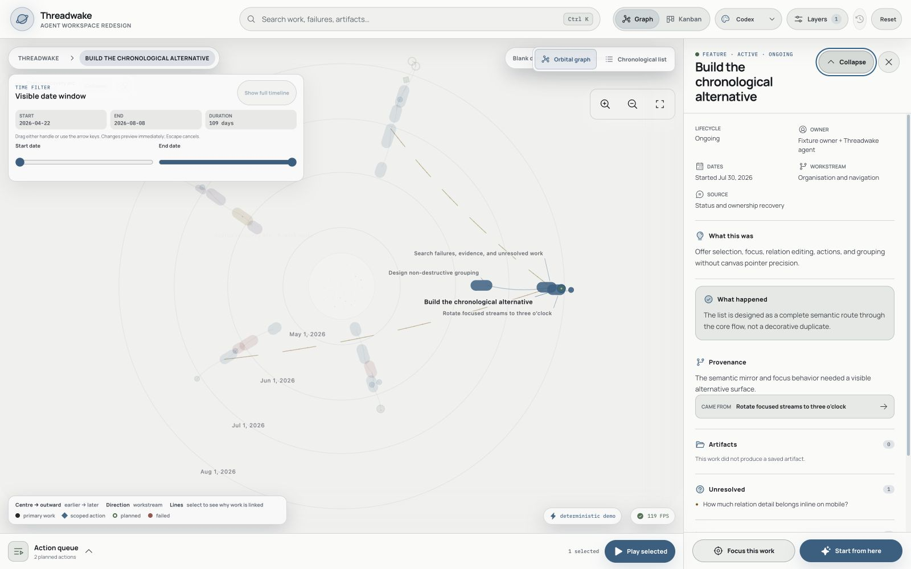
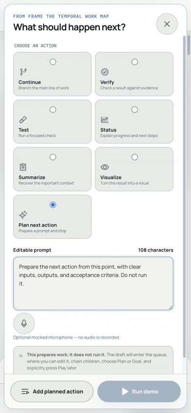

# Threadwake

[](https://github.com/albertbuchard/threadwake/actions/workflows/ci.yml)

Threadwake turns long-running agent work into one navigable workgraph, preserving evidence, provenance, rejected paths, lifecycle, outcome, and the exact context a next action should inherit.

> [!IMPORTANT]
> Threadwake is an independent user proposal. It is not an OpenAI product, is not endorsed by OpenAI, and is not listed in the public plugin directory.

## What is available now

This public repository contains a standalone synthetic visual application alongside shared contracts, a deterministic fixture MCP server, and an MCP-backed Codex plugin. The application and MCP fixture are separate evaluation surfaces; no application adapter connects them yet.

| Surface | Current state |
| --- | --- |
| Repository marketplace and plugin manifest | Validated; installed version `0.1.0+codex.20260809134453` |
| Threadwake skill | Installed and discovered as `threadwake:threadwake` in a fresh Codex task |
| Shared contracts | Implemented; generic documents can declare `synthetic: false`, while fixture documents require `synthetic: true` |
| Fixture MCP server | Implemented and verified with 8 tools over standard input/output and loopback-only stateful HTTP |
| MCP-backed plugin | `.mcp.json` launches a plugin-contained bundle; installed-cache bytes match the source package |
| Standalone web application | Imported through a public allowlist; Graph, 6-column Kanban, List, and Inspector run against labelled synthetic data |
| `Codex` theme | Implemented as an independent Threadwake theme using neutral white and gray surfaces with restrained blue accents |
| Application evidence | The current test run passes 15 app test files with 167 tests; production entry remains 290,384 bytes against a 444,077-byte ceiling |
| Contracts and MCP evidence | 6 test files with 31 tests pass; the plugin exposes exactly 8 fixture tools |
| Exact public-package validation | 76 repository-validator tests accept the current exact 132-file manifest |
| Creation-control placement | A machine-validated receipt records 5 responsive scenarios, 12 required controls per scenario, and 9 unobstructed hit-test samples per control |
| GitHub Actions workflow | Defined for Ubuntu 24.04; the badge above links to the authoritative hosted status for the current branch |
| Forge mode | Deliberately disabled boundary only; no live Forge input or output exists |
| MCP Apps visual widget | Not implemented; the repository contains the released pure task-link contract and synthetic tests, while the plugin remains one skill plus 8 tools |
| Hosted service, authentication, and public plugin submission | Not implemented or submitted |
| Sites hosting | Existing project is inaccessible with `project_not_found`; no duplicate project or new deployment is claimed |
| Public source and license | Published under Apache License 2.0 by Albert Buchard; not submitted to the public plugin directory |

The installed MCP tools can inspect and change only their deterministic in-memory synthetic fixture. They cannot access live Forge data or another external store. Fixture writes require a server-issued preview, exact current version, explicit confirmation value, and idempotency key.

The Threadwake skill can also help Codex reason about task content that a user supplies to the host product. The host product handles that content under its own settings and terms. This skill behavior does not give the Threadwake MCP tools access to live Forge data, another external store, or content outside the host task.

## See the current interface

The desktop workgraph shows one selected work unit, its relationships, provenance, unresolved question, and next actions in the independent `Codex` theme. The screenshot uses only the labelled synthetic application fixture.



The mobile node-action composer keeps its full border and footer inside a 390 by 844 viewport. The required **Add planned action** control remains visible and unobstructed above the bottom edge.



These images support the machine-readable placement receipt; they do not replace its complete-border-box and nine-point hit testing. [Evaluation details](docs/evaluation.md) record what the screenshots establish and which browser checks remain unproved.

## Why a workgraph

A conversation list tells you when work happened. It does not reliably tell you which work units are the same across sessions, how they depend on one another, why a path was rejected, what evidence supports a decision, or what context the next action needs.

Threadwake proposes one canonical work model with several views:

- Graph explains relationships, branches, and convergence.
- Kanban explains lifecycle without turning a column into a second copy of the work.
- List supports dense, keyboard-friendly search, sorting, filtering, and comparison.
- Inspector, history, and evidence explain the selected work unit and its provenance.

Every view must preserve the same stable work-unit identity. Visual position is never the source of truth.

## Run the verified local package

Use Node.js `22.22.0` and npm `11.12.1`, install from the lockfile, and run the complete local check:

```sh
npm ci
npm run check
```

`npm run check` includes the authoritative `npm run check:public-package` gate, production and QA application builds, type checking, and all implementation tests. The current implementation test run passes 15 app test files with 167 tests plus 6 contracts and MCP test files with 31 tests: 21 files and 198 implementation tests in one receipt. The public validator separately passes 76 tests against the exact 132-file manifest.

The production application entry is 290,384 bytes, below the 444,077-byte ceiling, and contains no QA instrumentation markers. The QA build loads its 5.56 kB performance instrumentation as a lazy chunk and includes a regression test for cleanup. These checks are bundle safeguards, not a formal Core Web Vitals measurement.

The repository also contains `.github/workflows/ci.yml`. It is configured to run checksum-pinned Gitleaks before repository-controlled commands, validate the package directly before dependency installation, perform an exact clean install, repeat the complete check, run both dependency audits, verify bundle and notices parity, check whitespace, and detect any change anywhere in the tracked worktree. The badge and linked Actions page report the authoritative GitHub-hosted status; local results are recorded separately in [Evaluation](docs/evaluation.md).

Run the server over standard input/output:

```sh
node packages/mcp-server/dist/threadwake-mcp.mjs --transport stdio
```

Or start the explicit loopback-only Streamable HTTP transport:

```sh
node packages/mcp-server/dist/threadwake-mcp.mjs \
  --transport http \
  --host 127.0.0.1 \
  --port 4318 \
  --allow-origin http://127.0.0.1:5173
```

HTTP mode is stateful for the process lifetime. It rejects non-loopback bind addresses, unapproved origins, invalid host headers, and oversized request bodies.

## Review the Codex plugin

Open this repository in Codex or Work mode in the ChatGPT desktop app. The repo-scoped marketplace is at `.agents/plugins/marketplace.json`, and the plugin is under `plugins/threadwake/`. Restart the desktop app if the local marketplace does not appear, then install **Threadwake** from **Threadwake Local**.

After installation, start a fresh task and try:

```text
Use Threadwake to list the synthetic workgraph, inspect the rejected path,
and preview moving unit-synthetic-layout from ready to in_progress.
Do not confirm the change.
```

The installed cache was tested with operating-system sandbox rules that denied reads from the source repository. The cached plugin still initialized and exposed all 8 tools. A fresh Codex `0.147.0` task using `gpt-5.6-sol` with extra-high reasoning discovered the skill and tools, then completed capabilities, list, and preview calls without confirming a write.

The plugin still has no MCP Apps widget or other embedded Threadwake visual interface. The repository now includes the released pure task-and-message source-link contract with synthetic tests, but it has no adapter, private snapshot, real task or message identifiers, or conversation excerpts. A later supported increment would be a thin, read-only wrapper after a separately reviewed public-safe shell is released. The current package deliberately excludes the unreleased Codex desktop mockup, host switch, and owner-only interface implementation. See [Evaluation](docs/evaluation.md) for the verified local evidence, the [encoded placement receipt](docs/evidence/action-composer-placement.json), and remaining gaps.

## Intended operating modes

1. **Local fixture MCP mode** provides 8 verified tools over standard input/output or loopback-only HTTP. State is synthetic, in memory, closed-world, and reset when the process exits.
2. **Local plugin mode** packages the skill and the same self-contained fixture server. It runs from the installed plugin cache without source-repository access.
3. **Standalone application mode** runs the imported Graph, Kanban, List, and Inspector against its own labelled synthetic state.
4. **Forge-backed mode** remains a disabled adapter boundary. Browser code will never receive Forge credentials, and no live Forge read or write is implemented.

The standalone application currently uses its imported synthetic domain and state layer. It is not connected to the MCP fixture. The MCP server separately uses its implemented `WorkGraphRepository` interface, with `FixtureWorkGraphStore` for synthetic state and `DisabledForgeWorkGraphStore` for the unsupported Forge boundary. A future application adapter must preserve stable work identity without creating another canonical copy.

Run the visual application locally:

```sh
npm run dev
```

Open the loopback URL printed by Vite. Add `?twv=1&view=kanban&theme=codex` to open the six-column Kanban view with the `Codex` theme.

## Proposal for OpenAI review

[The OpenAI proposal](docs/openai-proposal.md) asks whether a workgraph should become a supported way to understand and continue long-running Codex work. It presents the user problem, possible product surfaces, security boundary, adoption options, evidence plan, and specific questions for reviewers.

The proposal deliberately separates four claims:

- what the verified local contracts, fixture MCP server, and MCP-backed plugin do today;
- what the standalone application demonstrates with synthetic state today;
- what the local package evidence establishes and what it does not establish;
- what a hosted or public-directory integration would still require.

## Documentation

- [OpenAI proposal](docs/openai-proposal.md)
- [Architecture and trust boundaries](docs/architecture.md)
- [Codex plugin packaging](docs/plugin.md)
- [Standalone and Forge-backed MCP design](docs/forge-mcp.md)
- [Security and privacy](docs/security-and-privacy.md)
- [Evaluation and provisional review cases](docs/evaluation.md)
- [Themes and the implemented `Codex` palette](docs/themes.md)
- [Source provenance](docs/source-provenance.md)
- [External actions still required](docs/external-actions-required.md)
- [Contributing](CONTRIBUTING.md)
- [Security reporting](SECURITY.md)
- [Privacy policy](PRIVACY.md)
- [Terms of use](TERMS.md)
- [Support policy](SUPPORT.md)

## Security and data boundary

The verified package contains the synthetic standalone application, schemas, a separate deterministic MCP fixture, an in-memory MCP server, static plugin metadata, SVG marks, a skill, and a plugin-contained server bundle. Standard input/output stays within the spawning process. HTTP binds to loopback only and accepts an explicit allowed origin. A checksum-verified local Darwin scan with Gitleaks `8.30.1` found no leaks. There is no telemetry, hosted service, production authentication, live Forge connection, or multitenancy.

Future connected modes must keep credentials server-side, validate every external input, separate reads from writes, apply least privilege, require confirmation for material changes, and treat all work content as untrusted. See [Security and privacy](docs/security-and-privacy.md).

Do not place private conversations, credentials, access tokens, customer data, workplace records, or live Forge data in issues, pull requests, fixtures, screenshots, or evaluation reports.

## License and release status

Copyright 2026 Albert Buchard. First-party Threadwake code and documentation are licensed under [Apache License 2.0](LICENSE). Third-party materials retain their own licenses and notices.

This repository is the public local-evaluation release. It is not a hosted service and has not been submitted to or approved for the public plugin directory. The remaining hosted-service and directory-submission prerequisites are listed in [External actions still required](docs/external-actions-required.md).

## Official OpenAI references

Threadwake follows the current public documentation for [plugin packaging](https://developers.openai.com/plugins/build/plugins), [MCP server construction](https://developers.openai.com/plugins/build/mcp-server), [security and privacy](https://developers.openai.com/plugins/guides/security-privacy), and [plugin submission](https://developers.openai.com/plugins/deploy/submission). Those sources describe OpenAI requirements; they do not imply that OpenAI has reviewed Threadwake.
