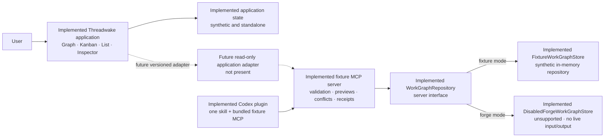
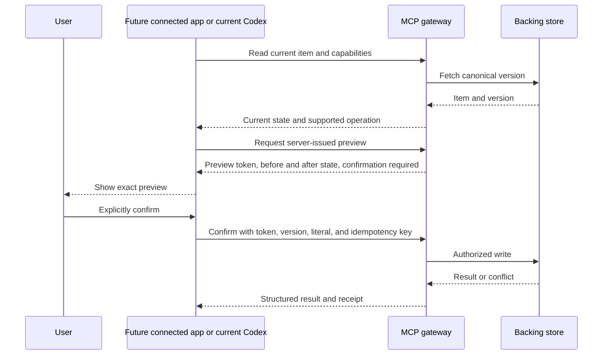

# Architecture and trust boundaries

## Architecture decision

Threadwake uses one workgraph model and keeps user-interface projections, transport, storage adapters, and host-specific credentials in separate layers.

The standalone synthetic application, shared contracts, deterministic fixture MCP server, and MCP-backed Codex plugin are implemented. The application and MCP fixture are not adapter-integrated. Forge exists only as isolated fixture-shaped application data and a disabled server boundary; neither path performs live Forge input or output.

## Current boundaries



The imported application runs its own deterministic synthetic state. It does not call the MCP server. The plugin runs a self-contained fixture MCP server from its installed cache. That server depends on `WorkGraphRepository`, which is implemented by `FixtureWorkGraphStore` for synthetic state and `DisabledForgeWorkGraphStore` for an always-unsupported Forge mode.

## Layer responsibilities

### Application

The application owns Graph, Kanban, List, Inspector, creation, local view preferences, keyboard and pointer interaction, and accessible feedback for its synthetic demonstration. It holds its state locally and contains no live credentials.

Graph, Kanban, List, and Inspector are projections. They can select, filter, sort, arrange, or preview work, but visual position must not silently invent hierarchy, lifecycle, outcome, or evidence.

The application currently uses its imported domain and state layer, including an isolated Forge-shaped fixture adapter for deterministic evaluation. It has no public adapter to the shared contracts or MCP server. A future adapter must preserve stable identity and keep transport-specific fields out of presentation components.

### Contracts

The shared contracts define versioned schemas for:

- capability discovery;
- work-unit identity and project or group metadata;
- supported hierarchy and relationships;
- lifecycle and outcome as separate fields;
- evidence, provenance, and rejected-path context;
- search, filters, deterministic sorting, and cursor pagination;
- next-action context transfer;
- change preview, confirmation requirements, conflicts, and receipts;
- health and explicit unsupported behavior.

External input is parsed at the boundary. A version mismatch or unsupported concept produces a structured error. The generic graph schema accepts `synthetic: true` or `false`. The fixture schema narrows that field to the literal value `true`, which prevents the fixture server from relabelling non-synthetic data as its test corpus.

Hierarchy validation rejects missing parents, project mismatches, and cycles. The cycle check uses a linear graph traversal, so its work grows as `O(V + E)` with work units and parent edges.

### Fixture MCP server

The server has a separate boundary named `WorkGraphRepository`. `FixtureWorkGraphStore` owns deterministic in-memory MCP fixture state. `DisabledForgeWorkGraphStore` returns unsupported for every operation and performs no live Forge input or output.

The server enforces:

- schema validation and capability checks;
- origin and session checks for a local browser connection;
- server-issued change previews;
- current-version checks, explicit confirmation, and idempotency;
- conflict handling, receipts, and one-level undo.

Only the most recently confirmed change on a work unit can be undone, and only if no later confirmed change has ever existed on that unit. Undoing that change does not reopen an earlier receipt. A receipt's `reversible` field describes conditional eligibility for this bounded mechanism, not a permanent rollback guarantee.

Tool annotations describe actual behavior. They do not replace server-side authorization, validation, or confirmation. See OpenAI's [MCP server guidance](https://developers.openai.com/plugins/build/mcp-server).

### Forge boundary

The server boundary rejects Forge mode as unavailable. Application mapping helpers are tested with explicit fixture-shaped values, but they cannot call Forge. Live reads, writes, credentials, authentication, tenant policy, hierarchy changes, context updates, and history operations are outside the implemented surface.

### Codex plugin

The plugin packages the Threadwake skill, `.mcp.json`, a dependency-bundled server at `server/threadwake-mcp.mjs`, and generated third-party notices. `.mcp.json` points only to the plugin-contained bundle.

The source and installed-cache bundle bytes match. An operating-system sandbox denied source-repository reads while the cached plugin initialized and exposed all 8 tools. The installed plugin therefore does not need sibling workspace files, repository-root dependencies, unpublished packages, or a network install at runtime.

The plugin contains one skill and 8 MCP tools only. It has no MCP Apps UI or widget. The application source now contains the released pure task-link contract and synthetic tests, but no adapter, private snapshot, real host identity, conversation excerpt, desktop mockup, host switch, or link user interface. A future embedded visual is limited to a thin, read-only wrapper after a separately reviewed public-safe shell is released.

### Repository-integrity workflow

The exact current package is defined by a 132-file manifest and checked by a dependency-free Node.js validator with 76 tests. The GitHub Actions workflow runs checksum-pinned Gitleaks before repository-controlled commands. It then validates the package before dependency installation, uses Node.js `22.22.0` and npm `11.12.1` for a clean install, runs implementation tests, type checks, production and QA builds, production and full dependency audits, bundle and notices parity, whitespace checks, and whole-worktree drift detection.

The workflow has passed locally and on GitHub-hosted Ubuntu. The [Actions history](https://github.com/albertbuchard/threadwake/actions/workflows/ci.yml) is the authoritative record for the exact commit under review.

## Canonical and local state

The MCP fixture includes stable identity, supported hierarchy, lifecycle, outcome, evidence, provenance, and next-action context. It does not expose history mutation, hierarchy attachment, or context-update tools.

Application view state includes the selected view, camera position, board scroll position, open panels, temporary filters, theme choice, and an unsubmitted form draft. The standalone application is a synthetic demonstration, not a connected canonical store. Once an adapter exists, a local optimistic change must remain a preview until the active store confirms it.

## Connected write sequence

The sequence below describes the implemented MCP write protocol and the requirement for any future application adapter:



A client animation is never proof that a change succeeded. Identical retries with the same key return the same result; a different request using that key fails.

## Trust boundaries

| Boundary | Trusted for | Never trusted for |
| --- | --- | --- |
| User interface | Display and local interaction | Authorization, connected persistence, credentials |
| Skill or model output | A proposed interpretation or tool request | Tool policy, tenant choice, write approval |
| Work content and evidence | Domain data after validation | Instructions, secrets, or authorization |
| Fixture MCP server | Schemas, preview binding, confirmation, and local receipts | Production authentication, live Forge access, or a feature outside the 8 tools |
| Forge adapter | Exact supported mapping | Inventing unsupported entities or guarantees |
| Visual layout | Orientation | Identity, hierarchy, lifecycle, or outcome |

## Failure model

The connected contract must distinguish invalid input, unsupported capability or version, unauthenticated and unauthorized requests, missing or stale work units, optimistic concurrency conflicts, unavailable backing services, partial external failure, unavailable rollback, and unsafe retry. Errors must be structured, useful, and free of credentials, raw prompts, stack traces, and unrelated user data.

## Workspace shape and stack

```text
app/                         implemented standalone synthetic React application
packages/contracts/          implemented framework-independent schemas and types
packages/mcp-server/         implemented fixture server and disabled Forge boundary
plugins/threadwake/          verified Codex manifest, skill, assets, and bundled server
docs/                        public proposal and evidence
```

The workspace uses Node.js 22.22.0 or later, npm 11.12.1, TypeScript 7.0.2, MCP SDK 1.30.0, Zod 4.4.3, esbuild 0.28.2, and Vitest 4.1.10. The application uses React 19.2.8, React DOM 19.2.8, Vite 7.3.6, PixiJS 8.19.0, Motion 12.43.0, Phosphor Icons React 2.1.10, Fontsource 5.3.0, Testing Library 16.3.2, User Event 14.6.3, jsdom 29.0.1, and CSS custom properties.

## Current evidence and gaps

The current evidence passes the 76-test repository validator against an exact 132-file manifest, 15 application files with 167 tests, and 6 contracts and MCP files with 31 tests. The implementation total is 21 files and 198 tests in one receipt. The production app entry remains 290,384 bytes against a 444,077-byte ceiling and excludes QA markers. The QA build lazy-loads a 5.56 kB instrumentation chunk and tests cleanup. Production and full audits report 0 vulnerabilities, and a checksum-verified local Darwin Gitleaks `8.30.1` scan found no leaks.

Live responsive checks cover 390 by 844, 390 by 600, and 320 by 568 viewports, a deterministic 2-times text-scale fixture, and a keyboard-safe-area fixture. The machine-validated [placement receipt](evidence/action-composer-placement.json) records all 12 required controls and both hit-test sequences at nine points per control. Separate synthetic screenshots preserve the 1600 by 1000 desktop workgraph and 390 by 844 mobile node-action composer. True 200% browser zoom, a formal Chrome DevTools or Core Web Vitals audit, GitHub-hosted continuous integration, live Forge behavior, and hosted authentication remain unproved.
