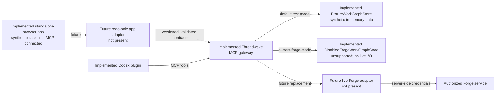

# Standalone and Forge-backed MCP design

## Current status

Threadwake's shared contracts and deterministic fixture MCP server are implemented and pass the documented local checks. The same dependency-bundled server is contained in the Codex plugin. Forge mode remains a deliberately disabled boundary with no live Forge input or output.

The verified executable target is the deterministic fixture-backed server. A future Forge-backed mode remains optional and isolated behind the same contract.

## Design goal

The current standalone application and current Codex plugin are separate evaluation surfaces. A future application adapter should let both see one workgraph contract regardless of storage. Neither client should need storage-specific fields or credentials.

The browser never receives Forge credentials and never calls Forge directly.

In prose: the browser application is present but uses its own deterministic synthetic state. It does not call the gateway. The implemented plugin communicates with the implemented Threadwake gateway. Fixture mode resolves requests through `FixtureWorkGraphStore`. Current Forge mode resolves to `DisabledForgeWorkGraphStore`, which always returns unsupported and cannot contact Forge. A future live adapter would replace that disabled implementation only after separate authorization, configuration, and validation.

## Shared contract

The versioned contract must represent:

- capabilities and protocol version;
- projects or groups without inventing unsupported hierarchy;
- work units with stable identifiers;
- supported parent-child and dependency relationships;
- lifecycle and outcome as separate fields;
- evidence and provenance;
- rejected-path context;
- search, filters, deterministic ordering, and cursor pagination;
- context transfer for the next action;
- change preview and confirmation requirements;
- optimistic concurrency, conflict receipts, and health.

Unknown fields can be preserved only when the schema defines a safe extension point. Unsupported concepts return an explicit capability or mapping error.

## Verified fixture mode

Fixture mode is the implemented local evaluation path. It requires no account, credentials, or external network service. The fixture is labelled synthetic and deterministic across clean checkouts.

The fixture server covers normal reads, empty and paginated results, invalid inputs, version conflicts, preview binding, explicit confirmation, identical retries, idempotency conflicts, one-level undo, and disabled or offline boundaries. Only the most recently confirmed change on a work unit can be undone, provided no later confirmed change has ever existed on that unit. Undoing it does not reopen an older receipt. This mode proves the local contract and safety behavior without touching live user work.

The generic workgraph schema permits `synthetic: false` for future non-fixture adapters. The fixture schema requires the literal value `true`. This separation preserves a general contract without allowing fixture mode to accept non-synthetic source data.

Parent-cycle validation uses a linear traversal over work units and parent edges. It therefore scales as `O(V + E)` rather than repeating a full ancestor scan for every unit.

## Forge mode

Forge mode currently reports itself as unsupported. The adapter boundary and mapping helpers cannot contact Forge. A future live adapter must be enabled only through explicit server configuration and must map each supported Forge concept exactly.

Before live operation, implementation evidence must establish:

- how Forge identities map to stable work-unit identifiers;
- which hierarchy and grouping relationships are canonical;
- which lifecycle transitions and outcomes are supported;
- how evidence and provenance are retrieved;
- how pagination, filtering, permissions, and conflicts behave;
- whether a write supports an idempotency key;
- whether read-back, undo, and rollback are available;
- which errors are safe to show to a user.

The adapter must never invent an entity, emulate a write that Forge cannot support safely, or describe best-effort retry as idempotency.

## Exact fixture MCP tools

The verified local server exposes exactly these 8 tools. It does not expose hierarchy attachment, context updates, history mutation, live Forge reads, or live Forge writes.

| Tool | Purpose | Verified annotations |
| --- | --- | --- |
| `threadwake_get_capabilities` | Return contract version, fixture mode, supported operations, and limits | read-only, not destructive, closed-world |
| `threadwake_list_work_units` | List, filter, sort, or page stable work units | read-only, not destructive, closed-world |
| `threadwake_get_work_unit` | Inspect one unit with parent, children, and explicit relations | read-only, not destructive, closed-world |
| `threadwake_search_work_units` | Search synthetic identifiers and text as inert data | read-only, not destructive, closed-world |
| `threadwake_get_evidence` | Retrieve evidence for one synthetic work unit | read-only, not destructive, closed-world |
| `threadwake_preview_fixture_change` | Validate one fixture lifecycle change and issue its preview token | read-only, not destructive, closed-world |
| `threadwake_confirm_fixture_change` | Apply one exact previewed fixture change; conditionally undoable only until any later change is confirmed on that work unit | write, destructive, idempotent, closed-world |
| `threadwake_undo_fixture_change` | Undo only the most recently confirmed change; never reopen an earlier receipt | write, destructive, idempotent, closed-world |

The confirm and undo annotations follow the MCP SDK meaning. They are destructive because they change state. They are idempotent for identical retries using the same key. They are closed-world because they do not affect an external or public system. A confirmation receipt's `reversible` field is conditional: any later confirmed change on the same work unit permanently prevents that receipt from being undone, even if the later change is itself undone.

## Write protocol

A fixture lifecycle write follows this verified sequence:

1. Discover capabilities.
2. Read the current item and version.
3. Validate the requested identity, relationship, transition, and permission.
4. Issue a server-generated preview token for the exact before-and-after state.
5. Accept confirmation only with that token, the current version, the exact confirmation literal, and an idempotency key.
6. Apply the in-memory fixture write.
7. Return the before-and-after state, fixture provenance, graph revision, and receipt or conflict.

A visual drag, model-generated instruction, or text embedded in a work unit is never authorization.

## Consistency and conflicts

Reads must use deterministic ordering and stable cursors. Writes must include the expected item version or equivalent concurrency condition. If the backing state changed, the server returns a conflict with enough non-sensitive information to refresh and reconsider the proposal.

The client must not silently overwrite, merge, or retry a conflicting write. The fixture server returns the same receipt for an identical retry with the same idempotency key and rejects a different request that reuses the key.

## Offline and partial failure

The disabled Forge boundary reports unsupported instead of approximating connected behavior. A future connected mode must make offline state explicit. A local optimistic card move can remain a non-canonical preview, but it cannot be shown as persisted.

If a backing write succeeds and read-back fails, the server returns an indeterminate result and an audit reference. The client must not retry blindly. Reconciliation reads the canonical state before proposing another action.

## Undo and rollback

Fixture undo is implemented only for the most recently confirmed change on a work unit, and only when no later confirmed change has ever existed on that unit. It requires the current version, that change's receipt, an explicit undo confirmation value, and an idempotency key. Undoing the change does not reopen any earlier receipt. The operation returns a structured receipt and cannot reach an external system.

A future Forge mode must expose undo only when the backing contract supports it. A compensating action is not described as a true rollback unless it restores the relevant state and invariants.

## Local browser gateway

The implemented HTTP transport binds only to loopback, checks the host and exact allowed origin, limits request bodies, issues cryptographically generated MCP session identifiers, and stops with the local process. It exposes Streamable HTTP at `/mcp`; `/health` reports process availability without returning work data.

The same server supports standard input/output for a process-spawned MCP client. HTTP state belongs to the process and resets on restart.

OpenAI's [MCP server guide](https://developers.openai.com/plugins/build/mcp-server) recommends testing Streamable HTTP with MCP Inspector, including initialization, tool list, representative and invalid calls, schemas, annotations, errors, and authorization.

## Future hosted endpoint

A hosted integration would require a stable public HTTPS Streamable HTTP endpoint, production authentication and authorization, tenant isolation, availability, logging and redaction, retention and deletion policy, support, domain verification, and review-ready credentials or fixtures.

For user-specific data, OpenAI's [authentication guidance](https://developers.openai.com/plugins/build/auth) describes OAuth authorization code with PKCE, protected-resource metadata, audience and scope checks, token verification on each request, and `401` reauthorization challenges.

None of that hosted behavior is implemented or authorized today.
